<p align="center">
  <picture>
    <source media="(prefers-color-scheme: dark)" srcset="docs/readme/banner-dark.svg">
    
  </picture>
</p>

<p align="center"><sub>English · <a href="#version-française">Version française</a></sub></p>

# Vigie

The iPhone app I use to watch a fleet of Claude Code agents: settle a mandate with Face ID, follow a thread, talk to a lead, wake a machine, dictate a message. It is the mobile half of [**ccremote**](https://github.com/Chrlstopher-c/ccremote), which runs the orchestrator and the teams.

The part I am proudest of has nothing to do with the screens. The whole thing is written in Swift 6 and compiled on Arch Linux with [xtool](https://github.com/xtool-org/xtool). No Mac, no Xcode, no simulator, ever.

> Status: in use. It builds on Linux, installs on the phone, and talks to the live control plane. Every capability of the server contract has a screen, and 156 tests cover the pure Swift core. Last active August 2026.

<p align="center">
  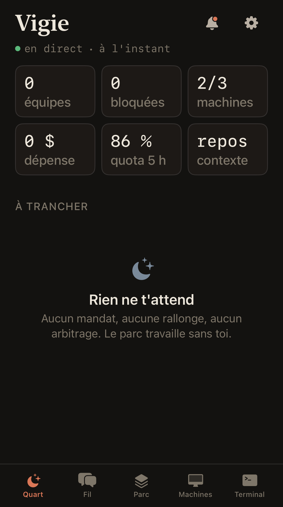
</p>
<p align="center"><sub>The watch screen when the fleet needs nothing from you. Counters at the top, and instead of an empty list, a sentence: <i>nothing is waiting for you, the fleet is working without you</i>.</sub></p>

## The screens

<table>
<tr>
<td width="33%">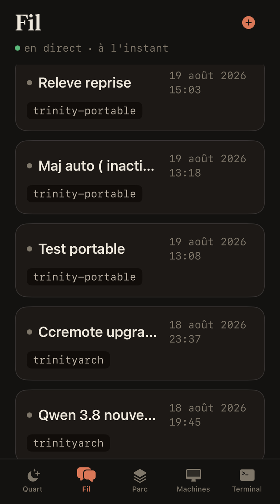</td>
<td width="33%">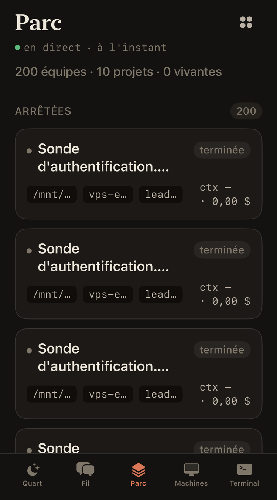</td>
<td width="33%">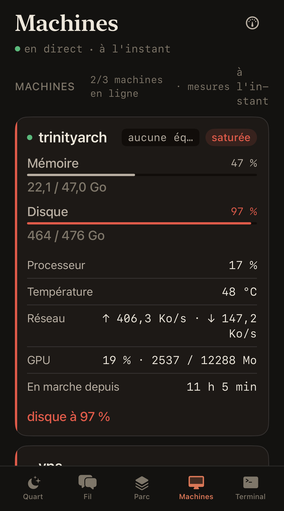</td>
</tr>
<tr>
<td><sub><b>Fil</b> lists your threads with the orchestrator, each tagged with the machine it runs on.</sub></td>
<td><sub><b>Parc</b> holds every team, grouped by state, with its project, its machine and what it cost.</sub></td>
<td><sub><b>Machines</b> reads memory, disk, CPU, temperature, network, GPU and uptime, and turns a card red past its threshold.</sub></td>
</tr>
</table>

<p align="center">
  <picture>
    <source media="(prefers-color-scheme: dark)" srcset="docs/readme/screens-dark.svg">
    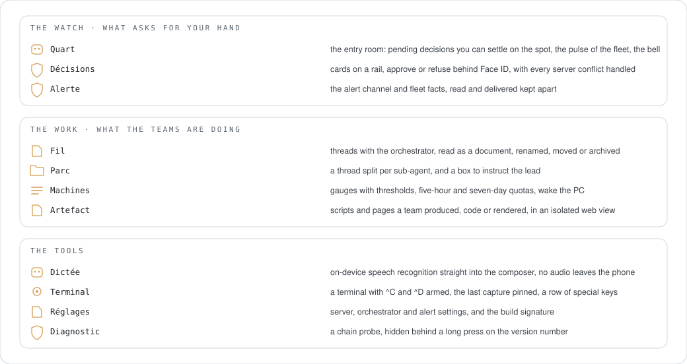
  </picture>
</p>

Everything is one dark theme called "Quart de nuit", the night watch. Warm neutrals on a near-black ground, one orange kept strictly for what waits for your hand, a serif for screen titles and a monospace for every number. When nothing needs you, the app says so rather than showing an empty list.

## How it works

<p align="center">
  <picture>
    <source media="(prefers-color-scheme: dark)" srcset="docs/readme/how-it-works-dark.svg">
    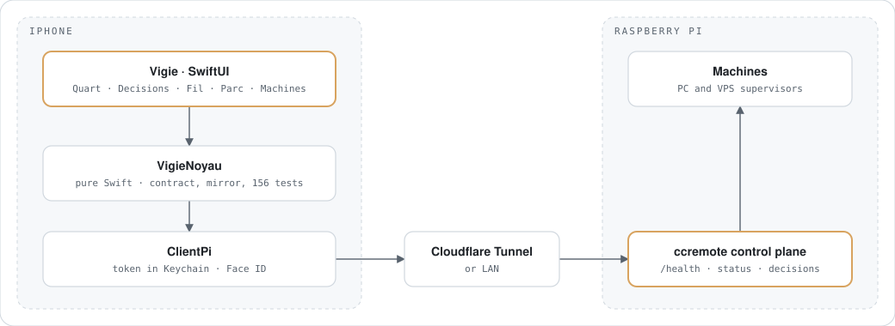
  </picture>
</p>

`VigieNoyau` is a target with no UIKit and no SwiftUI import: the API contract, thread segmentation, the local mirror, the watch logic. That is where the tests live, and it runs under `swift test` on Linux without a phone anywhere. `ClientPi` talks HTTP to the control plane through a Cloudflare Tunnel or the LAN, with the token in the Keychain and Face ID in front of anything that decides.

## Built without a Mac

<p align="center">
  <picture>
    <source media="(prefers-color-scheme: dark)" srcset="docs/readme/build-chain-dark.svg">
    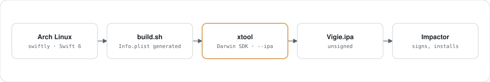
  </picture>
</p>

`Package.swift` exposes exactly one library product, which is what xtool wants from an app. `build.sh` writes the real `Info.plist` from a versioned template, substituting your addresses so no real hostname is ever committed. xtool produces an unsigned IPA of about 17 MB, and Impactor signs it with a free Apple ID. That signature lasts seven days, so redeploying is a weekly habit rather than a one-off.

## Install

<p align="center">
  <picture>
    <source media="(prefers-color-scheme: dark)" srcset="docs/readme/install-dark.svg">
    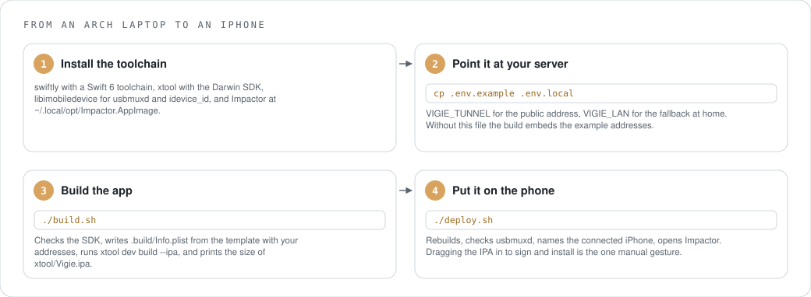
  </picture>
</p>

```sh
git clone https://github.com/Chrlstopher-c/vigie && cd vigie
cp .env.example .env.local     # VIGIE_TUNNEL and VIGIE_LAN, the addresses of your ccremote Pi
./build.sh                     # xtool/Vigie.ipa
./deploy.sh                    # rebuilds, finds the phone, opens Impactor
swift test                     # the core alone, no device needed
```

## Use

<p align="center">
  <picture>
    <source media="(prefers-color-scheme: dark)" srcset="docs/readme/usage-dark.svg">
    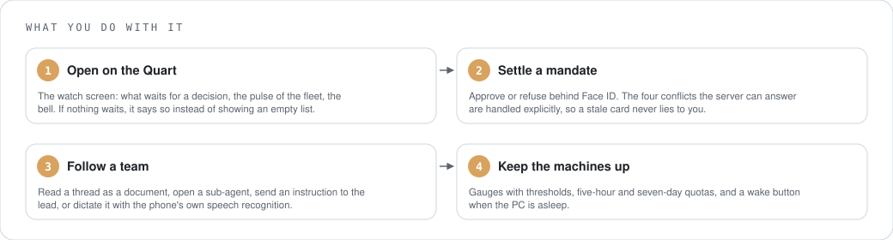
  </picture>
</p>

The first mandate of a thread waits for you. After that, if you have opened an autonomy window on the ccremote side, teams start without a click and Vigie becomes a place to watch rather than a gate to pass.

## Where things live

<p align="center">
  <picture>
    <source media="(prefers-color-scheme: dark)" srcset="docs/readme/files-dark.svg">
    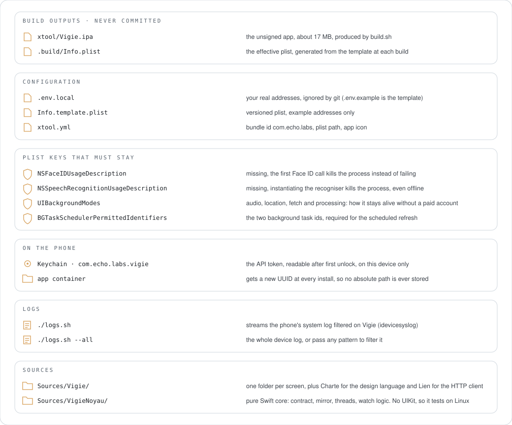
  </picture>
</p>

## Uninstall

<p align="center">
  <picture>
    <source media="(prefers-color-scheme: dark)" srcset="docs/readme/uninstall-dark.svg">
    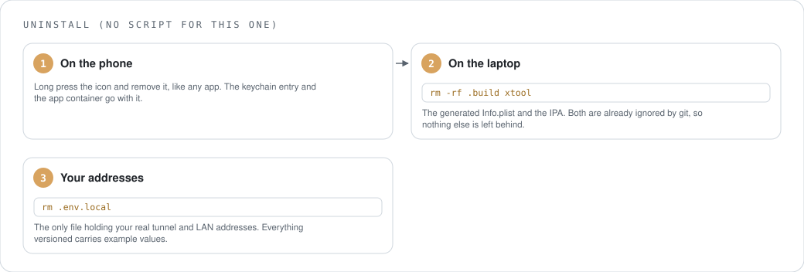
  </picture>
</p>

## Counted

<p align="center">
  <picture>
    <source media="(prefers-color-scheme: dark)" srcset="docs/readme/measured-dark.svg">
    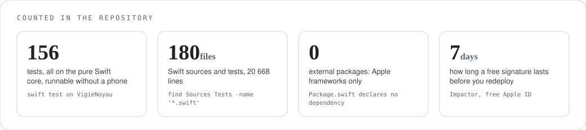
  </picture>
</p>

These are counts, not benchmarks. I have no performance figures for this app, because measuring them properly needs the device in hand and instruments I do not have on this chain.

## What it is built with

<p align="center">
  <picture>
    <source media="(prefers-color-scheme: dark)" srcset="docs/readme/deps-dark.svg">
    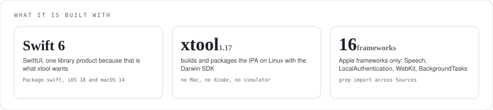
  </picture>
</p>

## Help

| Symptom | Cause | Fix |
|---|---|---|
| The app stops opening after a week | the free signature expired | run `./deploy.sh` again and resign |
| It crashes at the first Face ID prompt | `NSFaceIDUsageDescription` is missing from the plist | keep the key in `Info.template.plist`; without it the process is killed, not just refused |
| It crashes when you tap the microphone | same story with `NSSpeechRecognitionUsageDescription`, even though transcription is fully offline | keep that key too |
| Every call comes back as an HTML login page | the server answers `303` towards `/login` instead of `401` when the token is missing | `ClientPi` refuses redirects and surfaces the real error; check the token in Settings |
| A saved path breaks after a reinstall | iOS gives the app container a new UUID at every install | nothing to fix in the app, it stores no absolute path; do not add one |
| The battery drains and the radio never sleeps | the alert channel polls every 25 seconds with three requests in a row, about ten thousand a day | known, not fixed: an adaptive cadence is on the list |
| No swipe-back gesture | the navigation bar is hidden | known regression, not fixed |

`./logs.sh` streams the phone's own system log filtered on Vigie, which is the fastest way to see what actually happened. Open an issue with those lines and the output of the Diagnostic screen.

## Where it stands

Everything in the screenshots above is my own fleet, read live through the tunnel and rendered on the phone: the contract holds against the real server, not only against the tests.

What is still owed sits mostly on the other side. ccremote should answer `401` instead of redirecting to a login page, expose a cursor on notifications so a catch-up is never silently truncated, push a notification per mandate instead of waiting to be polled, and offer long polling for alerts. Until it does, the alert channel wakes every 25 seconds and fires three requests in a row, which keeps the phone's radio up far more than it should. The UI is in French.

## Project docs

`STATE.md` (current state and decisions), `TODO.md`, `BRIEF-FRONTEND.md`, `Sources/Vigie/Charte/CHARTE.md` for the design language.

## Licence

AGPL-3.0-or-later. See `LICENSE`.

---

## Version française

L'app iPhone avec laquelle je surveille un parc d'agents Claude Code : trancher un mandat avec Face ID, suivre un fil, parler à un lead, réveiller une machine, dicter un message. C'est la moitié mobile de [**ccremote**](https://github.com/Chrlstopher-c/ccremote), qui fait tourner l'orchestrateur et les équipes.

Ce dont je suis le plus fier n'a rien à voir avec les écrans. Le tout est écrit en Swift 6 et compilé sur Arch Linux avec [xtool](https://github.com/xtool-org/xtool). Sans Mac, sans Xcode, sans simulateur.

> État : en service. Ça compile sur Linux, ça s'installe sur le téléphone, et ça parle au control plane en direct. Chaque capacité du contrat serveur a un écran, et 156 tests couvrent le noyau Swift pur. Dernière activité : août 2026.

<p align="center">
  
</p>
<p align="center"><sub>L'écran de quart quand le parc n'a besoin de rien. Les compteurs en haut, et à la place d'une liste vide, une phrase : <i>rien ne t'attend, le parc travaille sans toi</i>.</sub></p>

### Les écrans

<table>
<tr>
<td width="33%"></td>
<td width="33%"></td>
<td width="33%"></td>
</tr>
<tr>
<td><sub><b>Fil</b> liste tes conversations avec l'orchestrateur, chacune marquée de la machine où elle tourne.</sub></td>
<td><sub><b>Parc</b> tient chaque équipe, groupée par état, avec son projet, sa machine et ce qu'elle a coûté.</sub></td>
<td><sub><b>Machines</b> lit mémoire, disque, processeur, température, réseau, GPU et uptime, et passe une carte au rouge au-delà du seuil.</sub></td>
</tr>
</table>

<p align="center">
  <picture>
    <source media="(prefers-color-scheme: dark)" srcset="docs/readme/screens-dark.svg">
    
  </picture>
</p>

Tout tient dans un seul thème sombre appelé « Quart de nuit ». Des neutres chauds sur un fond presque noir, un orange réservé strictement à ce qui attend un geste de ta part, une serif pour les titres d'écran et une monospace pour tout ce qui est chiffré. Quand rien ne t'attend, l'app le dit au lieu d'afficher une liste vide.

### Comment ça marche

<p align="center">
  <picture>
    <source media="(prefers-color-scheme: dark)" srcset="docs/readme/how-it-works-dark.svg">
    
  </picture>
</p>

`VigieNoyau` est une cible sans import UIKit ni SwiftUI : le contrat d'API, la segmentation des fils, le miroir local, la logique de veille. C'est là que vivent les tests, et ça tourne sous `swift test` sur Linux sans le moindre téléphone. `ClientPi` parle en HTTP au control plane via un tunnel Cloudflare ou le LAN, avec le jeton dans le trousseau et Face ID devant tout ce qui décide.

### Compilé sans Mac

<p align="center">
  <picture>
    <source media="(prefers-color-scheme: dark)" srcset="docs/readme/build-chain-dark.svg">
    
  </picture>
</p>

`Package.swift` expose exactement un produit `.library`, ce que xtool attend d'une app. `build.sh` écrit le vrai `Info.plist` depuis un gabarit versionné, en y substituant tes adresses pour qu'aucun nom d'hôte réel ne soit jamais commité. xtool produit un IPA non signé d'environ 17 Mo, et Impactor le signe avec un identifiant Apple gratuit. Cette signature dure sept jours : redéployer est donc une habitude hebdomadaire, pas un geste unique.

### Installation

<p align="center">
  <picture>
    <source media="(prefers-color-scheme: dark)" srcset="docs/readme/install-dark.svg">
    
  </picture>
</p>

```sh
git clone https://github.com/Chrlstopher-c/vigie && cd vigie
cp .env.example .env.local     # VIGIE_TUNNEL et VIGIE_LAN, les adresses de ton Pi ccremote
./build.sh                     # xtool/Vigie.ipa
./deploy.sh                    # recompile, trouve le téléphone, ouvre Impactor
swift test                     # le noyau seul, sans appareil
```

### Utilisation

<p align="center">
  <picture>
    <source media="(prefers-color-scheme: dark)" srcset="docs/readme/usage-dark.svg">
    
  </picture>
</p>

Le premier mandat d'un fil t'attend. Ensuite, si tu as ouvert une fenêtre d'autonomie côté ccremote, les équipes démarrent sans clic et Vigie devient un endroit où regarder plutôt qu'un portillon à franchir.

### Où sont les choses

<p align="center">
  <picture>
    <source media="(prefers-color-scheme: dark)" srcset="docs/readme/files-dark.svg">
    
  </picture>
</p>

### Désinstallation

<p align="center">
  <picture>
    <source media="(prefers-color-scheme: dark)" srcset="docs/readme/uninstall-dark.svg">
    
  </picture>
</p>

### Compté

<p align="center">
  <picture>
    <source media="(prefers-color-scheme: dark)" srcset="docs/readme/measured-dark.svg">
    
  </picture>
</p>

Ce sont des décomptes, pas des benchmarks. Je n'ai aucun chiffre de performance pour cette app, parce que les mesurer correctement demande l'appareil en main et des instruments que cette chaîne n'a pas.

### Avec quoi c'est construit

<p align="center">
  <picture>
    <source media="(prefers-color-scheme: dark)" srcset="docs/readme/deps-dark.svg">
    
  </picture>
</p>

### Aide

| Symptôme | Cause | Remède |
|---|---|---|
| L'app ne s'ouvre plus au bout d'une semaine | la signature gratuite a expiré | relance `./deploy.sh` et resigne |
| Plantage au premier Face ID | `NSFaceIDUsageDescription` manque dans le plist | garde la clé dans `Info.template.plist` ; sans elle le processus est tué, pas seulement refusé |
| Plantage quand tu touches le micro | même histoire avec `NSSpeechRecognitionUsageDescription`, alors que la transcription est entièrement hors ligne | garde cette clé aussi |
| Chaque appel revient sous forme de page de login HTML | le serveur répond `303` vers `/login` au lieu de `401` quand le jeton manque | `ClientPi` refuse les redirections et remonte la vraie erreur ; vérifie le jeton dans les Réglages |
| Un chemin enregistré casse après une réinstallation | iOS donne un nouvel UUID au conteneur à chaque pose | rien à corriger dans l'app, elle ne stocke aucun chemin absolu ; n'en ajoute pas |
| La batterie fond et la radio ne dort jamais | le canal d'alerte sonde toutes les 25 secondes avec trois requêtes à la suite, environ dix mille par jour | connu, non corrigé : une cadence adaptative est sur la liste |
| Plus de glissement de bord pour revenir | la barre de navigation est masquée | régression connue, non corrigée |

`./logs.sh` streame le journal système du téléphone filtré sur Vigie, c'est le moyen le plus rapide de voir ce qui s'est réellement passé. Ouvre une issue avec ces lignes et la sortie de l'écran Diagnostic.

### Où ça en est

Tout ce qui est sur les captures plus haut est mon propre parc, lu en direct à travers le tunnel et rendu sur le téléphone : le contrat tient contre le vrai serveur, pas seulement contre les tests.

Ce qui reste dû l'est surtout de l'autre côté. ccremote devrait répondre `401` au lieu de rediriger vers une page de login, exposer un curseur sur les notifications pour qu'un rattrapage ne soit jamais tronqué en silence, pousser une notification par mandat au lieu d'attendre d'être sondé, et offrir du long polling pour les alertes. En attendant, le canal d'alerte se réveille toutes les 25 secondes et enchaîne trois requêtes, ce qui tient la radio du téléphone allumée bien plus qu'il ne faudrait.

### Documentation du projet

`STATE.md` (état courant et décisions), `TODO.md`, `BRIEF-FRONTEND.md`, `Sources/Vigie/Charte/CHARTE.md` pour la charte graphique.

### Licence

AGPL-3.0-or-later. Voir `LICENSE`.
